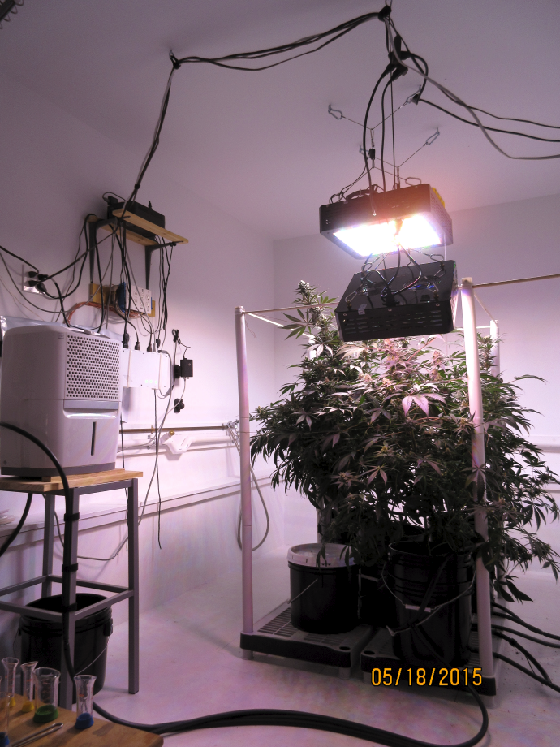

# The Humble Roots Project (v0.4)
**Home Automation Applied To Medical Cannabis Cultivation**

The *Humble Roots Project* is a grow room automation system designed to meet indoor cannabis horticulture
challenges using open software, open hardware and readily available consumer appliances. The project
blends these elements together into an inexpensive, reliable, automated system, with a focus
on sustainability.

The application of the concepts and technology used as part of the Humble Roots Project is not limited
to indoor growing or horticulture; it has far-reaching applications to many other automation scenarios
where sensors, actuators, rules and data visualization are combined to solve a problem.

For in-depth details about the project, check out the [project documentation](./docs/HumbleRootsProject.pdf).



**Plant Growth Timelapse**

<a href="http://www.youtube.com/watch?feature=player_embedded&v=OL0RneAysnU
" target="_blank"></a>

## Getting Started

1. Install the *Humble Roots Project* files

	```
	git clone https://github.com/fabienroyer/Humble-Roots-Project.git
	```
2. Assemble the wireless [sensor](./arduino/README.md) and [actuator](./hardware/README.md) nodes.
3. Upload the [Arduino sketches](./arduino/README.md) to the wireless nodes.
4. Install the [project dependencies](./dependencies.md).
5. [Configure](./config/README.md) the ['bootstrap'](./config/bootstrap.json.template) and ['config'](./config/config.json.template) files.
6. Start the project processes, in the following order:
..1. The *Control* module

```
./control.py
```

You should see the following console output:

```
Started: ./control.py
config loaded.
Connection Accepted.
MQTT started.
Config published.
Connection Accepted.
Controller started.
```

and as the *Control* module begins processing sensor data and timer rules, you should see a console output like this:

```
~
node:plant
value=45.0
{u'to': u'20:00', u'from': u'19:00'}
node=relay&cmd=act&r=water&s=off
Pending
ack
~
node:plant
value=-71.0
{u'setpoint': -80.0, u'title': u'Low signal strength alert', u'op': u'<'}
~
node:relay
value=-65.0
{u'setpoint': -80.0, u'title': u'Low signal strength alert', u'op': u'<'}
~
node:sump
value=23.93
{u'setpoint': 21.0, u'title': u'High water level alert', u'op': u'<='}
{u'setpoint': 22.1, u'cmd': u'node=relay&cmd=act&r=drain&s=on', u'op': u'<='}
{u'setpoint': 26.5, u'cmd': u'node=relay&cmd=act&r=drain&s=off', u'op': u'>='}
~
node:sump
value=-55.0
{u'setpoint': -80.0, u'title': u'Low signal strength alert', u'op': u'<'}
~
node:climate
value=25.5
{u'setpoint': 30.0, u'title': u'High temperature alert', u'op': u'>='}
{u'setpoint': 24.0, u'cmd': u'node=relay&cmd=act&r=vent&s=on', u'op': u'>'}
node=relay&cmd=act&r=vent&s=on
Pending
ack
~
node:climate
value=52.0
{u'setpoint': 56.0, u'title': u'High humidity alert', u'op': u'>='}
{u'setpoint': 54.0, u'cmd': u'node=relay&cmd=act&r=dh&s=on', u'op': u'>'}
{u'cmd': u'node=relay&cmd=act&r=dh&s=off'}
node=relay&cmd=act&r=dh&s=off
Pending
ack
```

..2. The *Gateway* module

```
./gateway.py
```

You should see the following console output:

```
Started: ./gateway.py
MQTT started.
Connection Accepted.
Config sync'ed.
Gateway started.
```

..3. If InfluxDB is configured, start the *DB* module

```
./db.py
```

You should see the following console output:

```
Started: ./db.py
MQTT started.
Connection Accepted.
Config sync'ed.
DB connected.
Listening for sensor data.
```

..4. If PushBullet is configured, start the *Notify* module

```
./notify.py
```

You should see the following console output:

```
Started: ./notify.py
MQTT started.
Connection Accepted.
Config sync'ed.
Notifier started...
```

As commands get sent from your mobile device, you should see messages like this:

```
Title: control June 25, 2015 at 1201PM, Body: node=relay&cmd=act&r=vent&s=off
Title: control June 25, 2015 at 1202PM, Body: get=report
Title: command June 25, 2015 at 1204PM, Body: node=valve&cmd=act&v=filter&s=on
Title: control June 25, 2015 at 1208PM, Body: node=valve&cmd=act&v=filter&s=off
```

..5. As a sanity check, you can peek into the raw data being published by the application module at anytime.

```
./peek.py
```

You should see an output similar to this:

```
ts=1435277835
node=40&rssi=-67&t=clm&bat=3.76&low=0&pwr=0&tmp=25.28&rh=52&ts=1435277844
node=20&r=2&cmd=act&s=1&tok=jVQXy
node=20&r=2&cmd=act&s=1&tok=jVQXy&tx=ack&ts=1435277844
node=20&r=0&cmd=act&s=0&tok=YwpQy
node=20&rssi=-62&t=rly&bat=5.00&low=0&pwr=1&r=2&s=1&ts=1435277844
node=20&r=0&cmd=act&s=0&tok=YwpQy&tx=ack&ts=1435277844
node=20&rssi=-62&t=rly&bat=5.00&low=0&pwr=1&r=0&s=0&ts=1435277844
node=4&rssi=-53&t=lvl&bat=1.63&low=1&pwr=0&cm=23.83&ts=1435277862
ts=1435277866
node=2&rssi=-77&t=srh&bat=4.67&low=0&pwr=1&p=45&ts=1435277870
node=20&r=3&cmd=act&s=0&tok=j0LDj
node=20&r=3&cmd=act&s=0&tok=j0LDj&tx=ack&ts=1435277870
node=20&rssi=-62&t=rly&bat=5.00&low=0&pwr=1&r=3&s=0&ts=1435277870
```


