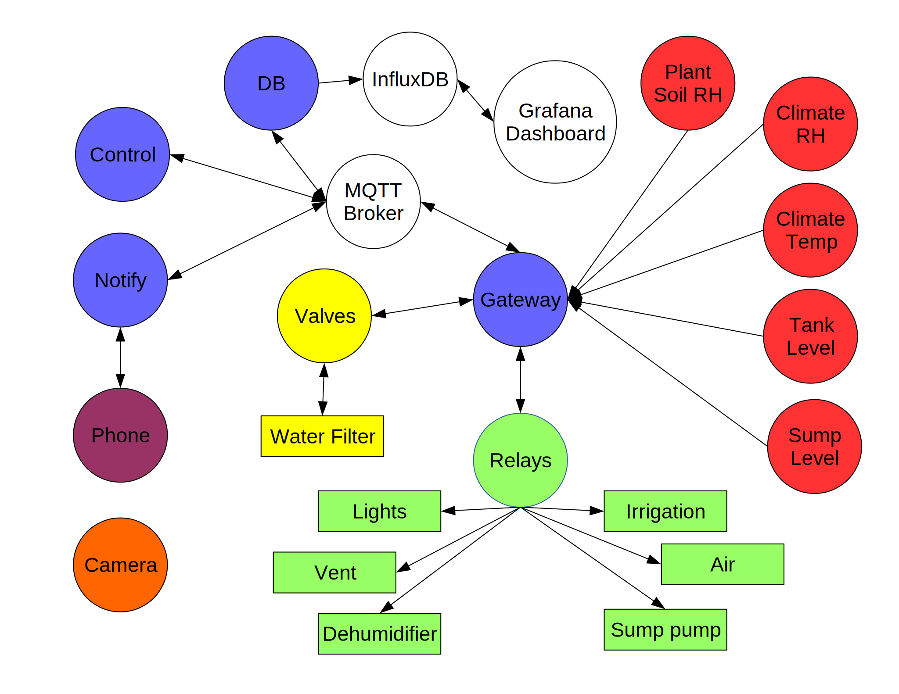

# Humble Roots Project Configuration

As mentioned in the [project overview](../docs/HumbleRootsProject.pdf), the software driving the automation is composed of several modules (blue circles in the architecture diagram below), each running within its own process. The modules communicate with each other by publishing messages to various topics through an [MQTT broker](http://mqtt.org/). Based on their function, the modules also subscribe to topics of interest and react whenever messages are being published.

## Architecture Diagram



## First time installation

Out of the box, the project provides two template configuration files that must be renamed and edited for the project to work. This ensures that future project updates will not destroy your local configuration. This only needs to be done once.

1. Switch to the './config' project folder.
2. Copy ['bootstrap.json.template'](./bootstrap.json.template) to 'bootstrap.json'
3. Copy ['config.json.template'](./config.json.template) to 'config.json'

### The role of the 'bootstrap.json' configuration file

The role of 'bootstrap.json' is to allow distributed modules to find and connect to an MQTT broker. The exception to this is the *Control* process. By default, the MQTT broker is expected to be located on the local host. Once a process is connected to its MQTT broker, it receives its configuration settings by subscribing to the 'config' MQTT topic managed centrally by the *Control* process.

#### 'mqtt' section

This is the only section in this configuration file. It should reflect the connection settings defined for the MQTT broker itself.

```
{
"mqtt": {
	"host": "localhost",
	"port": 1883,
	"keepalive": 60,
	"rootPrefix": "hrs"
	}
}
```

**Security Warning**: there's currently no security measures in place to secure connections to the MQTT broker. This will be adressed in the near future, but in the meantime, the MQTT broker and the *Humble Roots Project* processes should all run on the same local machine, preferably on an isolated, secured network segment. In addition, external connections to the MQTT broker should be blocked by a firewall on the local host. **Under no circumstances should the MQTT broker be exposed to the Internet unsecured**. For details on **how to secure MQTT**, check out this excellent [series of articles](http://www.hivemq.com/mqtt-security-fundamentals-wrap-up) written by the folks at HiveMQ.

### The role of the 'config.json' configuration file

The *Control* process performs several functions, one of which is to publish the content of the 'config.json' file on the 'config' topic, thereby making it available to the other modules. This method of sharing configuration settings is necessary when the application modules are distributed on separate systems.

The 'config.json' file is composed of several sections controlling the different features of the project.

#### "mqtt" section

This section is used by all the application modules to connect to the MQTT broker after bootstrapping themselves. It is identical to the MQTT settings in the 'bootstrap.json' file. If the MQTT settings change here, the same changes must to be applied to the 'bootstrap.json' file(s).

```
"mqtt": {
	"host": "localhost",
	"port": 1883,
	"keepalive": 60,
	"rootPrefix": "hrs"
	}
```

"rootPrefix": defines a namespace for all the subtopics used by the application.

This allows for multiple instances of the project to run side-by-side on the same broker if needed.

#### "serial" section

This section is used by the *Gateway* module to communicate with the gateway node over a serial port.

```
"serial": {
	"port": "/dev/ttyUSB0",
	"baudrate": 115200,
	"pubPrefix": "ser",
	"subPrefix": "cmd"
	}
```

"port": specifies the device attached to the *gateway* node. It is set to "/dev/ttyUSB0" by default but this may vary if other serial devices are connected to the machine.

"baudrate": By default, the "baudrate" is set to match the speed of the *gateway* node.

"pubPrefix": specifies the topic under which the *Gateway* module publishes data coming from the *gateway* node.

"subPrefix": specifies the topic where the *Control* module publishes commands to be sent to the wireless nodes through the *gateway* node.

#### "influxDB" section

This section is used by the *DB* module which writes sensor data to the InfluxDB database.

```
"influxDB": {
	"enabled": 0,
	"host": "localhost",
	"port": 8086,
	"user": "<DB USER>",
	"pswd": "<DB PSWD>",
	"db": "sensors"
	}
```

"enabled": by default, the feature is disabled. Set it to 1 to enable it when InfluxDB is up and running.

"host": specifies the domain name or IP address of the host running InfluxDB. By default, this is the local host.

"port": specifies the port number where InfluxDB listens for REST API calls.

"user": specifies the user to be used for authenticating to the InfluxDB instance.

"pswd": specifies the password of the user.

"db": specifies the name of the database where incoming sensor data should be written.

#### "PushBullet" section

This section is used by the *Notify* module which handles push notifications between mobile devices and the application using the [PushBullet API](https://docs.pushbullet.com/).

```
"PushBullet": {
	"enabled": 0,
	"token": "<YOUR APPLICATION TOKEN>",
	"appDevice": "HumbleRoots",
	"alertDevice": "<MOBILE DEVICE PB ID>",
	"alertNumber": "+1 425 555 1212",
	"subPrefix": "notify",
	"accept": {"note": 0, "alert": 0}
	}
```

"enabled": by default, the feature is disabled. Set it to 1 to enable it once your PushBullet account is created and configured.

"token": every application using the PushBullet API requires a unique token. To generate this token, simple go to the [PushBullet account page](https://www.pushbullet.com/account) and copy the **Access Token** shown on the page. Then, simply paste the token here between the double quotes.

"appDevice": specifies an arbitratry device name representing the *Humble Roots Project" application. The push notifications emitted by the application will show up under this device name.

"alertDevice": specifies the ID of the mobile device registered with PushBullet that will be used to send SMS messages (Android only, at the moment). You can find a list of the devices registered with PushBullet under the [Devices account page](https://www.pushbullet.com/edit-devices).

"alertNumber": specifies the target phone number for the SMS messages which should be phone number of the device specified as the "alertDevice" above.

"subPrefix": specifies the topic subscribed to by the *Notify* module in order to send notifications as SMS messages to the "alertDevice" or as push notifications to the "appDevice".

"accept": specifies the types of messages supported by the *Notify* module. Messages of type "note" are forwarded to the "appDevice" while messages of type "alert" are forwarded to the "alertDevice".

#### "sensorDataParser" section

This section is used by several of the application modules, such as the *DB* module in order to only accept relevant sensor data messages.
As new device types get added to the sensor and actuator network, they need to be listed here.

```
"sensorDataParser": {
	"accept": {"srh": 0, "lvl": 0, "clm": 0, "rly": 0, "vlv": 0}
	}
```

#### "node" section

This section maps wireless node identifiers to friendly names.
As new devices get added to the sensor and actuator network, they need to be listed here.
Note that **the friendly names must be unique** just like their corresponding IDs.

```
"node": {
	"2": "plant",
	"4": "sump",
	"20": "relay",
	"30": "tank",
	"40": "climate",
	"50": "valve"
	}
```

#### "r" section

This section maps the IDs of the power outlets used by the *relay* actuator node to friendly names.
Note that **the friendly names must be unique** just like their corresponding IDs.

```
"r":	{
	"0": "dh",
	"1": "drain",
	"2": "vent",
	"3": "water",
	"4": "light",
	"5": "air"
	}
```
#### "v" section.

This section maps the IDs of the contacts used by the *valve* actuator node to friendly names.
Note that **the friendly names must be unique** just like their corresponding IDs.

```
"v":	{
	"0": "filter",
	"1": "v1",
	"2": "v2",
	"3": "v3",
	"4": "v4",
	"5": "v5",
	"6": "v6",
	"7": "v7"
	}
```

#### "s" section

This section maps the state zero and one to their corresponding OFF and ON friendly names.
This is used in context with actuator nodes, such as the *relay* and the *valve*, to express the state of the actuators.
Note that **the friendly names must be unique** just like their corresponding IDs.

```
"s":	{
	"0": "off",
	"1": "on"
	}
```

#### "control" section

To be continued...


